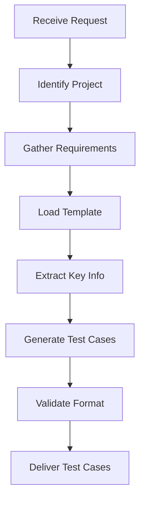

# Test Case Creation Workflow Configuration

**Purpose:** Standardized step-by-step process for creating IPETRONIK-compliant test cases efficiently.

> **⚡ Quick Start:** For fast test case creation, use **[.github/copilot-instructions.md](.github/copilot-instructions.md)** - it consolidates all essential information in one place.
>
> **This document provides detailed step-by-step workflow guidance.**


## 🎯 Workflow Overview



---

## 📋 Step-by-Step Workflow

### **STEP 1: Identify Project Type**

**What I Need:**
- Project identifier (IPE891, IPEcloud, IPEmotion, IPEmotionRT, XPI)
- Ticket/Issue ID (e.g., IM-44385, XPI-17638)

**Actions:**
1. Determine project from user request or ticket ID prefix
2. Set project context for documentation reference

**Quick Reference:**
- **IPE891** → COPYstation2 product
- **IPEcloud** → Cloud platform functionality
- **IPEmotion** → Main DAQ software (Windows/Linux)
- **IPEmotionRT** → Real-time logger functionality
- **XPI** → X-PlugIn hardware modules

---

### **STEP 2: Gather Requirements & Context**

**What I Need:**
- Requirement specification/ticket description
- Feature description or user story
- Acceptance criteria

**Actions:**
1. **Read requirement document** (if provided)
2. **Check HELP_DOCUMENT_TOC.md** for relevant documentation paths
3. **Read specific help documents** based on feature area:
   - For hardware: Chapter/Section on hardware setup
   - For UI features: Chapter on specific workspace
   - For protocols: Protocol-specific documentation
   - For plugins: Plugin-specific documentation

**Documentation Lookup Strategy:**
```
┌─ Use HELP_DOCUMENT_TOC.md Table
│
├─ Locate Project Section
│  └─ Find relevant chapters/documents
│
├─ Read Core Documentation (specs, business cases)
│
└─ Read Specific Chapters based on feature:
   ├─ Signal Configuration → Chapter 13
   ├─ Acquisition → Chapter 17
   ├─ Hardware → Chapters 27-31
   ├─ Interfaces → Chapter 14, 16
   ├─ X-PlugIn → Section 6, 7, 8
   └─ Quick Start → Chapters 4-5
```

**Key Information to Extract:**
- [ ] Feature name/functionality
- [ ] Expected behavior
- [ ] Hardware requirements (if any)
- [ ] Software requirements (versions, licenses)
- [ ] Input parameters/configurations
- [ ] Expected outputs/results
- [ ] Edge cases/boundary conditions
- [ ] Error scenarios

---

### **STEP 3: Load Appropriate Template**

**Template Paths:**
- IPE891: `Template/IPE891/IPE891_Template.md`
- IPEcloud: `Template/IPEcloud/` (if exists)
- IPEmotion: `Template/IPEmotion/IPEmotion_Template.md`
- IPEmotionRT: `Template/IPEmotionRT/IPEmotionRT_Template.md`
- XPI: `Template/XPI/XPI_Template.md`

**Action:**
```bash
Read template for the identified project
```

---

### **STEP 4: Determine Test Case Structure**

**Count Required Test Cases:**

Based on requirement complexity:
- **Simple feature** → 1-3 test cases
  - TC_001: Basic positive test
  - TC_002: Boundary test
  - TC_003: Error handling

- **Medium complexity** → 3-5 test cases
  - TC_001: Basic positive scenario
  - TC_002: Multiple parameters/signals
  - TC_003: Complex scenario
  - TC_004: Signal validation
  - TC_005: Error handling

- **Complex feature** → 5-10 test cases
  - Multiple positive scenarios
  - Multiple negative scenarios
  - Performance tests
  - Integration tests

**Coverage Strategy:**
- ✅ **Positive Testing:** Normal operation, expected inputs
- ✅ **Negative Testing:** Invalid inputs, error conditions
- ⚠️ **Performance Testing:** Load, timing, resource usage
- ✅ **Functional Testing:** Feature completeness

---

### **STEP 5: Generate Each Test Case**

#### **5.1 Test Case Header**

```markdown
# [TICKET-ID-##] - [Descriptive Title]

Format:
- XPI-17638-01 - Period Duration Measurement Default Parameters
- TC_001 - Basic PCAP Import Single Signal
- IM-62175 - Table View Font Color Size
```

#### **5.2 Description Section**

**What to include:**
- Brief 1-2 sentence description
- What functionality is being validated
- Reference to specific requirements (if applicable)

**Example:**
```markdown
## Description
Verify that IPEmotion can successfully import a PCAP file containing
Ethernet traffic and extract a single signal using ARXML signal definitions.
```

#### **5.3 Pre-Condition Section**

**Project-Specific Formats:**

**For XPI/Hardware Projects:**
```markdown
## Pre-Condition

| IPEmotion PC | IPEmotion RT |
|--------------|--------------|
| Power supply between 9,3V and 36V | Power supply between 9,3V and 36V |
| Connect [Interface] to PC via USB | Connect Logger |
| Connect [Device] with [Interface] via [Cable PN] | Connect [Device] via [Cable PN] |
| Connect [Cable Type] ([Part Number]) to [Channel] | Connect [Cable Type] ([Part Number]) to [Channel] |
| [Specific wiring/setup] | [Specific wiring/setup] |

**[Test Equipment Name]:**
- Parameter 1: Value
- Parameter 2: Value
- Function: [Setting]
- Frequency: [Value]
```

**For IPEmotion Software Projects:**
```markdown
## Pre-Condition

### Software Setup:

#### Windows
- IPEmotion [version] installed
- Required plugins: [List or "None"]
- Required licenses: [List specific licenses]
- Test data location: C:\TestData\[TICKET-ID]\[TC-ID]\
- Required files:
  - file1.pcap (description)
  - file2.arxml (description)
- Hardware requirements: [If any]

#### Linux
- IPEmotion [version] installed (Docker/native)
- Required plugins: [List or "None"]
- Required licenses: [List specific licenses]
- Test data location: /home/testuser/TestData/[TICKET-ID]/[TC-ID]/
- Required files: [Same as Windows]
- Ensure read/write permissions on test folder
```

**For IPEmotionRT Projects:**
```markdown
## Pre-Condition

### Required Licenses:
**IPEmotionRT Logger:**
- License name 1
- License name 2

### Hardware Setup:

| IPEmotion | IPEmotion RT |
|-----------|--------------|
| [PC setup] | [Logger setup] |

### Software Setup:

| IPEmotion | IPEmotion RT |
|-----------|--------------|
| [Software config] | [Software config] |
```

#### **5.4 Test Steps Section**

**Table Format (All Projects):**

```markdown
## Test Steps

| Step | RT Steps / Input Data | Expected Result |
|------|----------------------|-----------------|
| 1 | [Action] | [Expected outcome] |
| 2 | [Action] | [Expected outcome] |
| ... | ... | ... |
```

**Best Practices for Test Steps:**

1. **Be Specific with Navigation:**
   ```
   Good: File → Import → Traffic Files → PCAP
   Bad: Import file
   ```

2. **Use Clear Action Verbs:**
   - Start, Launch, Open
   - Click, Select, Browse
   - Navigate to, Switch to
   - Verify, Check, Validate
   - Configure, Set, Enter

3. **Expected Results - Be Exact:**
   ```
   Good:
   "Import Dialog" window opens with following fields:
   - File path: [empty]
   - Format: [PCAP selected]
   - Button: [Import] enabled

   Bad:
   Dialog opens
   ```

4. **For XPI Hardware Tests:**
   ```
   | Display | | 542xxxxx_1 shows about 10ms<br>Status channel LED is green, LED on device is off |
   ```

5. **For Multi-Platform (Windows/Linux):**
   - Avoid OS-specific paths in steps
   - Use "[test folder]" placeholder
   - Specify path differences in Pre-Condition

6. **For Signal/Data Validation:**
   ```
   | Verify signal values | | Index 0: 10.5<br>Index 1: 11.2<br>Index 2: 12.0<br>Range: 10.5 - 15.3 km/h |
   ```

7. **For Properties/Configuration:**
   ```
   | Signal → Properties → General | | The following data is available:<br><br>Name: SpeedSignal<br>Type: uint16<br>Unit: km/h<br>Min: 0<br>Max: 120 |
   ```

**Step Numbering:**
- Use sequential numbers (1, 2, 3...)
- For sub-steps, use line breaks within cell
- For parallel operations (RT vs PC), use "RT Steps / Input Data" column

#### **5.5 Notes Section**

**What to Include:**

```markdown
## Notes
- Hardware wiring: [Specific pin connections with reference numbers]
- Cable specifications: [Part numbers - description]
- Device behavior: [Expected states, LED indicators]
- Status indicators:
  - Channel LED colors: [green=OK, red=error, yellow=warning]
  - Device LED states: [on/off/blinking]
- Expected messages: [Exact text of warnings/errors]
- Test data details: [File locations, sizes, frame counts]
- Calculations: [Formulas used, tolerance values]
- Reference: [Requirement ID, Specification section]
- KD Item: [Item number if applicable]
- Manual reference: [Chapter numbers]
```

**Example Notes:**
```markdown
## Notes
- Wiring according to MCNT3_4-259 - HW-IF: Kanal-Steckverbinder-Typ 1
- Pin 2 and Pin 3 must be short-circuited
- Cable: SIM-CNT-IN BANANA (600-402 or 600-561)
- Expected period duration = 1 / Frequency (e.g., 100Hz → 10ms)
- Tolerance: ±0.1ms for measurements
- Test PCAP contains 1000 frames
- Reference: IPEmotion User Manual Chapter 21 (DATA MANAGER)
- KD Item: IM-44385
```

#### **5.6 Priority Section**

**Priority Levels:**

```markdown
## Priority
High | Medium | Low
```

**Guidelines:**
- **High:** Core functionality, safety-critical, blocking issues
- **Medium:** Important features, data validation, user workflows
- **Low:** Edge cases, cosmetic issues, nice-to-have features

#### **5.7 Coverage Section**

```markdown
## Coverage
- [x] Positive Testing
- [x] Negative Testing
- [ ] Performance Testing
- [x] Functional Testing
```

**Mark checkboxes based on test case type:**
- Always check: Functional Testing
- Check if testing: Normal operations → Positive Testing
- Check if testing: Error scenarios → Negative Testing
- Check if testing: Speed/load/timing → Performance Testing

---

### **STEP 6: Validate Generated Test Cases**

**Quality Checklist:**

#### Format Validation:
- [ ] Test case ID follows project convention
- [ ] Title is descriptive and unique
- [ ] Description is clear and concise
- [ ] All required sections present

#### Pre-Condition Validation:
- [ ] Correct table format for project type
- [ ] All hardware specified with part numbers
- [ ] All software/licenses specified with versions
- [ ] Test data paths are clear
- [ ] Setup is reproducible

#### Test Steps Validation:
- [ ] Steps are numbered sequentially
- [ ] Actions are specific and clear
- [ ] Expected results are detailed and exact
- [ ] Navigation paths use → separator
- [ ] No ambiguous instructions

#### Completeness:
- [ ] All requirement aspects covered
- [ ] Positive scenarios included
- [ ] Negative/error scenarios included
- [ ] Edge cases identified
- [ ] Verification steps included

#### Technical Accuracy:
- [ ] Hardware specifications match IPETRONIK standards
- [ ] Software versions are current
- [ ] File paths match convention
- [ ] Cable part numbers are correct
- [ ] Reference documentation cited

---

### **STEP 7: Organize and Deliver**

**File Structure:**

```
Testcases/
  └── [Project]/
      └── [TICKET-ID]/
          ├── 00_Requirement_[TICKET-ID].md (optional)
          ├── 01_Scenarios_[TICKET-ID].md (optional)
          ├── TC_001_[Descriptive_Name].md
          ├── TC_002_[Descriptive_Name].md
          ├── TC_003_[Descriptive_Name].md
          └── ...
```

**Naming Conventions:**

**IPEmotion/IPEmotionRT/IPEcloud:**
- `TC_001_Feature_Description.md`
- `TC_002_Feature_Variant.md`

**XPI:**
- `XPI-17638-01_Feature_Description.md`
- `XPI-17638-02_Feature_Variant.md`

**IPE891:**
- `IPE891-[ID]_Feature_Description.md`

**File Creation Order:**
1. Create test case files (TC_001, TC_002, etc.)
2. Create scenario document if needed (01_Scenarios)
3. Create requirement document if needed (00_Requirement)

---

## 🔧 Quick Reference: Project-Specific Details

### **XPI Test Cases**

**Focus Areas:**
- Hardware module configuration (M-CNT, X-modules)
- Channel configuration and wiring
- Signal measurement types
- LED status indicators
- Parallel channel testing

**Key Documentation:**
- XPI X-PlugIn sections 6, 7, 8
- IPEmotion Chapter 15 (X-PlugIn Option)

**Common Elements:**
- Two-column pre-condition (PC vs RT)
- Device part numbers (542xxxxx format)
- Cable specifications (6xx-xxx format)
- Status indicators (LED colors/states)
- Test equipment configuration (frequency generators, etc.)

---

### **IPEmotion Test Cases**

**Focus Areas:**
- File import/export (PCAP, MDF4, etc.)
- Signal workspace operations
- Data manager functionality
- View/Analysis workspace
- Plugin functionality

**Key Documentation:**
- Chapters 12-24 (Workspaces)
- Chapter 21 (Data Manager)
- Chapter 13 (SIGNALS)

**Common Elements:**
- Windows/Linux dual setup
- Test data file paths
- License requirements
- Step-by-step UI navigation
- Signal property validation

---

### **IPEmotionRT Test Cases**

**Focus Areas:**
- Logger configuration
- Real-time data acquisition
- Hardware logger setup (IPElog2, M-LOG, etc.)
- Remote logger operations
- Communication protocols

**Key Documentation:**
- Chapters 26-40 (RT-specific)
- Chapters 27-31 (Hardware setup)

**Common Elements:**
- License requirements section
- Two-column setup (PC vs Logger)
- Logger synchronization
- Status monitoring
- Configuration file handling

---

### **IPEcloud Test Cases**

**Focus Areas:**
- Cloud upload/download
- MeaUpload functionality
- User management
- Data synchronization
- Web interface operations

**Key Documentation:**
- User Manual V5.0.0
- Business case documents
- User stories

**Common Elements:**
- Web interface navigation
- User authentication
- File upload/download
- API interactions
- Multi-user scenarios

---

### **IPE891 Test Cases**

**Focus Areas:**
- COPYstation2 device operations
- Device configuration
- Data copying/transfer
- Status monitoring

**Key Documentation:**
- Product Requirement Specification
- TRS document

**Common Elements:**
- Single-column pre-condition
- Device-specific operations
- Hardware connections

---

## ⚡ Efficiency Tips

### **Parallel Test Case Generation:**

When creating multiple test cases:
1. Read all requirements first
2. Identify common pre-conditions
3. Generate all test cases in one batch
4. Reuse common sections across test cases

### **Documentation Reference Strategy:**

1. **First Time:**
   - Review HELP_DOCUMENT_TOC.md
   - Read relevant chapters thoroughly
   - Note key concepts and references

2. **Subsequent Times:**
   - Reference previous test cases for similar features
   - Quick lookup in TOC for specific details
   - Read only delta/new information

### **Template Reuse:**

- Keep common pre-condition blocks ready
- Maintain library of common test steps
- Reuse hardware setup descriptions
- Copy device configurations across similar tests

---

## 📋 Pre-Flight Checklist

**Before Starting Test Case Creation:**

- [ ] Project type identified
- [ ] Ticket/Issue ID confirmed
- [ ] Requirements document/description available
- [ ] HELP_DOCUMENT_TOC.md reviewed
- [ ] Relevant documentation chapters identified
- [ ] Template loaded for project type
- [ ] Target folder structure confirmed

**During Test Case Creation:**

- [ ] Test case ID assigned correctly
- [ ] Title is descriptive
- [ ] Pre-conditions complete and accurate
- [ ] Test steps are clear and executable
- [ ] Expected results are specific
- [ ] Notes include all necessary details
- [ ] Priority set appropriately
- [ ] Coverage checkboxes marked

**After Test Case Creation:**

- [ ] All test cases generated
- [ ] Format validation passed
- [ ] Technical accuracy verified
- [ ] Files named correctly
- [ ] Files placed in correct folder
- [ ] Cross-references checked
- [ ] Ready for user review

---

## 🎓 Learning from Examples

**Example Reference Test Cases:**

**XPI Hardware:**
- `Testcases/XPI/XPI-17638/XPI-17638-01_Period_Duration_Measurement_Default_Parameters.md`
- Shows: Hardware setup, device configuration, frequency testing

**IPEmotion Software:**
- `Testcases/IPEmotion/IM-44385/TC_001_Basic_PCAP_Import_Single_Signal.md`
- Shows: File import, signal validation, Windows/Linux setup

**When in doubt:**
- Review similar existing test cases
- Check template for section structure
- Verify hardware part numbers in documentation
- Confirm file path conventions

---

## 🚀 Workflow Optimization

**Time Estimates:**

- **Simple test case:** 3-5 minutes
- **Medium test case:** 5-10 minutes
- **Complex test case:** 10-15 minutes
- **Test suite (5-10 cases):** 30-45 minutes

**Speed Factors:**

✅ **Fast:**
- Clear requirements
- Similar to previous test cases
- Standard template usage
- Common hardware/software setup

⚠️ **Slower:**
- Vague requirements → Need more research
- New hardware/feature → Need documentation review
- Complex multi-step scenarios
- Multiple platforms/configurations

---

**End of Workflow Configuration**

*This document should be referenced at the start of every test case creation request.*
